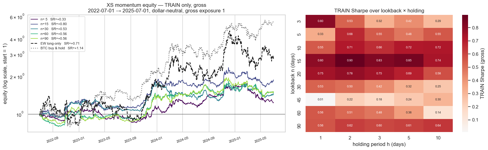
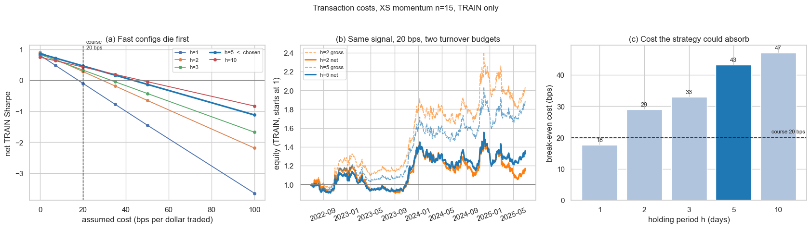
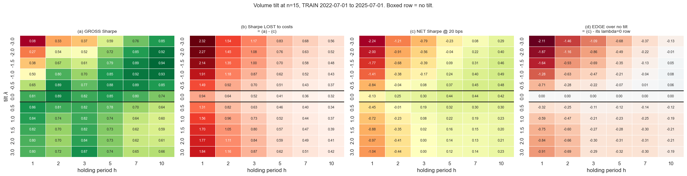
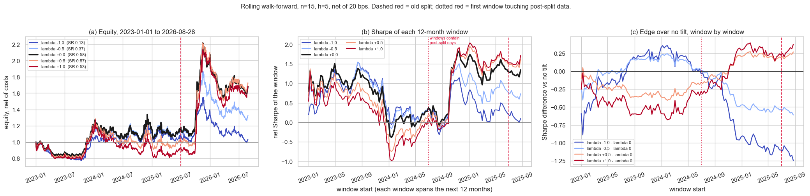
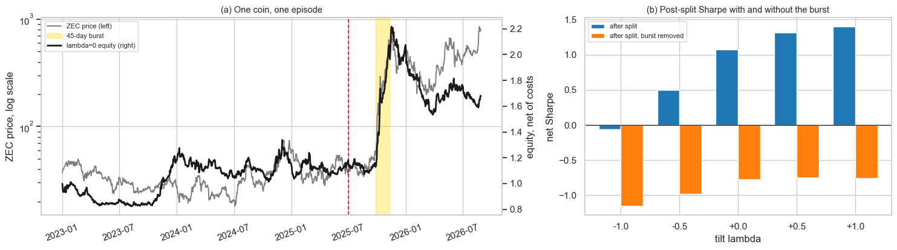
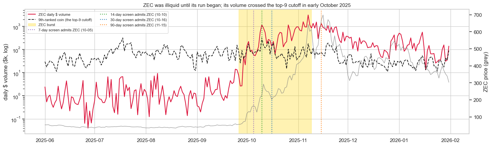
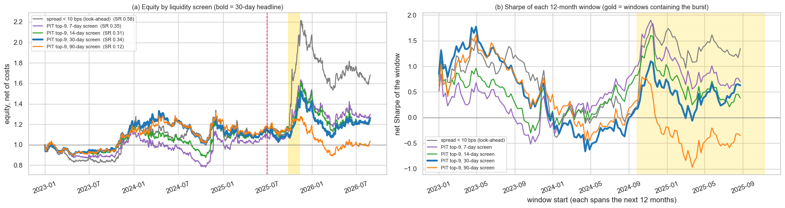

# Cross-Sectional Momentum in Crypto: a Stress-Tested Backtest

**WSQ course project — Statistical Arbitrage in Cryptocurrencies** · Ryan · September 2026

Evidence: [`research.ipynb`](../research.ipynb) · rejected strategies: [`research_failed.ipynb`](../research_failed.ipynb),
indexed by [`strategy_log.md`](strategy_log.md)

---

## Abstract

I built a dollar-neutral, cross-sectional momentum strategy on liquid Binance.US coins. It ranks each coin's
trailing 15-day return, goes long relative winners and short relative losers, and holds for 5 days. In-sample it
earned a gross Sharpe of **0.85** with near-zero BTC beta. A 20 bps cost assumption cut that to **0.46**. A volume-based
sizing overlay improved gross results but did not survive costs. A 139-window rolling walk-forward then traced most
of the out-of-sample gain to one 45-day trend in ZEC, a coin the universe contained only because its liquidity was
measured after that trend. A point-in-time liquidity universe keeps part of that trade and scores a walk-forward net
Sharpe of **0.34**. With the 45-day episode removed, the net Sharpe is **≈ 0 under every universe definition**. The
result is one capturable momentum episode, not evidence of a persistent edge.

---

## 1. Data and universe

| | |
|---|---|
| Venue | Binance.US, hourly OHLCV, UTC, resampled to daily closes |
| Panel | 60 coins listed on both Binance.US and Coinbase, stablecoins excluded, ≥ 90% hourly coverage |
| History | 2022-01 → 2026-08 |
| Trading universe | 9 coins with real order-book spread < 10 bps: ADA, AVAX, BNB, BTC, DOGE, ETH, LTC, SOL, ZEC |
| Benchmark | BTC |

**Two biases are built into this data.** They shape how the results should be read.

- **Universe look-ahead.** Spreads were measured from live order books in August–September 2026, then used to
  choose a universe back to 2022. Section 4.5 replaces this with a point-in-time liquidity screen.
- **Survivorship.** The panel is the set of coins listed in 2026 with enough history. All 60 first list in 2022,
  and any coin that listed and later delisted is absent. The backtest therefore runs on survivors and likely
  overstates how implementable the strategy was. Ranking *within* survivors dollar-neutrally weakens the bias
  relative to a long-only book, but does not remove it. This is stated, not corrected.

## 2. Method

**Signal and portfolio.** Each day, rank the universe by trailing 15-day return. Demean the ranks so the book is
dollar-neutral, and normalize so gross exposure is 1. Hold for *h* days with overlapping tranches:
`w_t = mean(daily_book_{t-k}, k = 0..h-1)`. The validated book is *conviction-sized*: each leg is weighted by distance
from the median rank and normalized to 0.5 gross. The cost section used plain rank weights, which is the same
signal sized differently (TRAIN net 0.46 vs 0.44).

**P&L and cost timing.** P&L on day *t* is `w_{t-1} · r_t`. The trade that set `w_{t-1}` is charged on the same
day: `cost_t = 20 bps × Σ|w_{t-1} − w_{t-2}|`. Twenty basis points is the course's market-order assumption
(7 bps commission + 13 bps slippage).

**Metrics.** These follow course convention. Returns are aggregated to daily, Sharpe = mean / std × √252, and
alpha, alpha t-stat, beta and correlation come from an OLS regression on BTC daily returns. The √252 convention on
365-day crypto data understates Sharpe by about 17%; it is kept for consistency.

**Protocol.** Parameters were chosen on **TRAIN (2022-07-01 → 2025-07-01)**:
- *n* on gross Sharpe
- *h* on net Sharpe
- nothing else

The original single validation split was compromised, because earlier exploratory work had touched it. It was
retired in favour of a **rolling walk-forward**: 139 windows of 12 months, stepped 7 days, from 2023-01-01 to
2026-08-28. Parameters stay fixed throughout, so this is a stability test of one frozen strategy. Consecutive
windows overlap 51 of 52 weeks, so the 139 windows amount to roughly 3–4 independent observations.

---

## 3. In-sample: a promising, market-neutral signal

Every one of the 45 (lookback × holding) cells has a positive gross TRAIN Sharpe (median 0.55), so the result is not
one lucky corner. The best cell is n = 15, h = 2 at 0.90. Beta to BTC is near zero by construction and in practice.

## 4. Results

### 4.1 Costs halved the Sharpe and chose the holding period

| n = 15, TRAIN, 20 bps | h = 1 | h = 2 (gross best) | **h = 5** |
|---|---|---|---|
| gross Sharpe | 0.80 | 0.90 | 0.85 |
| net Sharpe | −0.10 | 0.28 | **0.46** |
| turnover / day | — | 0.25 | 0.15 |

Turnover falls roughly like 1/h while gross Sharpe is nearly flat, so holding longer costs little signal and saves
most of the bill. Only *h* was re-chosen with costs in view. The net-optimal grid corner (n = 90, h = 10) was
deliberately not taken: a turnover penalty always pushes toward long lookbacks and long holds, so that corner is
partly mechanical. The **break-even cost is 43 bps**, and at h = 5 the result survives anything under that.

### 4.2 The volume tilt did not survive costs

The course brief suggests activity indicators strengthen momentum. Earlier tests found the opposite sign: momentum
worked better on relatively *quiet* coins. The overlay tested was `conviction × exp(λ · volume z-score)`,
re-normalized per leg to stay dollar-neutral.

- **(a) Gross.** Sharpe improves smoothly toward λ < 0 and long holds, peaking at 0.94. This is why the idea was
  persuasive.
- **(b) Costs.** The Sharpe lost to costs rises with |λ| on *both* sides. The tilt adds turnover because the volume
  z-score moves every day, regardless of its sign.
- **(c)–(d) Net.** At the frozen h = 5, **every tilt loses to no tilt** (best −0.07). In the walk-forward, the
  hypothesised down-tilt (λ = −1) scored 0.13 against 0.58 for no tilt.

The tilt is a turnover dial, not an information signal. Smoothing the signal or changing rebalance frequency might
recover some of it, but that would be a parameter search, so it was not pursued.

### 4.3 Walk-forward: stable, until one coin

| λ | net SR 2023-01 → 2026-08 | net SR after 2025-07 | mean window SR | % windows > 0 |
|---|---|---|---|---|
| −1.0 | 0.13 | −0.06 | 0.53 | 94% |
| **0 (frozen)** | **0.58** | **1.07** | **0.86** | 92% |
| +1.0 | 0.53 | 1.40 | 0.66 | 73% |

No tilt wins. The equity curve, however, is flat for most of 2024–2025 and then nearly doubles in a few weeks of
late 2025.

### 4.4 One coin: ZEC

The largest 45-day stretch after the split ran from 2025-09-26 to 2025-11-09. ZEC rose from 56 to 614, about 11×.
The book made **+82%** over those 45 days, and **+51% of it came from ZEC alone**. Without that stretch, the
post-split Sharpe goes from 1.07 to −0.77.

ZEC was in the universe because its spread was under 10 bps *in 2026*, after the run had made it liquid. That is
the universe look-ahead flagged in Section 1, and after 2025-07 it carries the result.

### 4.5 Point-in-time universes: part of the trade was real

Simply deleting ZEC would overcorrect. If its liquidity rose quickly enough, a real-time trader would have added it
during the move. I tested this directly: each day, take the top 9 coins by trailing median dollar volume, lagged one
day. I swept screen speeds, with **the 30-day screen fixed as the headline before any of its Sharpes were computed**.

ZEC traded ~$1–7k a day on Binance.US through Q3 2025, 15–100× below the top-9 cutoff. Its volume then rose from $8k
(09-26) to $846k (10-11), crossing the cutoff early in the run.

| walk-forward 2023-01 → 2026-08, net of 20 bps | look-ahead | 7-day | 14-day | **30-day** | 90-day |
|---|---|---|---|---|---|
| ZEC first admitted | always | 10-05 | 10-10 | **10-16** | 11-15 |
| net Sharpe | 0.58 | 0.35 | 0.31 | **0.34** | 0.12 |
| return over the 45-day burst | +82% | +42% | +30% | **+30%** | +9% |
| **net Sharpe, burst removed** | 0.01 | −0.01 | 0.04 | **0.04** | 0.02 |
| turnover / day | 0.150 | 0.178 | 0.168 | 0.162 | 0.155 |

**About half of the look-ahead result survives a real-time universe.** What was not capturable is the ~12% ZEC
position held through September, when ZEC traded around $2k a day, and ZEC more than doubled before any screen
admitted it. Faster screens churn membership, and that turnover is charged at the same 20 bps.

### 4.6 The finding is concentration

With the 45-day burst removed, walk-forward net Sharpe is **−0.01 to +0.04 under every universe**: look-ahead or
real-time, fast screen or slow. Every book also lost money in the months after the run ended. Momentum did what it
should — it caught a coin trending as it became liquid — and earned roughly nothing otherwise.

Removing the *largest* 45-day stretch is a deliberate stress test, not an unbiased estimate, since removing any
strategy's best stretch lowers its Sharpe. The narrower point stands: the out-of-sample evidence rests on one
episode, so it cannot establish a persistent edge.

---

## 5. Robustness

**Sample start.** The primary sample begins 2022-07-01. The cut was set in the research protocol before momentum
was built, motivated by the 2022-H1 LUNA/3AC collapse. It was not blind to the data, though: earlier reversal work had
used the full sample, and a BTC-direction argument is weak for a dollar-neutral book. So full history is reported as
a first-class period:

| net Sharpe, PIT 30-day screen | full history (2022-01-21 →) | primary (2022-07-01 →) |
|---|---|---|
| net Sharpe | 0.38 | 0.44 |
| burst removed | 0.16 | 0.19 |

Putting 2022-H1 back lowers the result modestly and changes nothing in the story. The ex-burst figures here are
higher than on the walk-forward span because they include 2022-H2, which sits inside TRAIN, where n and h were chosen.
Both are well within one standard error (≈ 0.4) of zero.

**Universe through 2025-07.** On TRAIN, the look-ahead and point-in-time universes agree (net 0.44 vs 0.48). The
look-ahead only becomes load-bearing after 2025-07, through ZEC.

**Liquidity proxy.** Trailing dollar volume has a rank correlation of −0.90 with real 2026 spreads, and today's top 9
by volume matches the spread set on 8 of 9 coins. That validation exists for 2026 only.

---

## 6. Final statistics

Frozen spec: n = 15, h = 5, conviction-sized, no tilt, net of 20 bps. Alpha, t-stat, beta, correlation, volatility
and drawdown are computed on **net** daily returns against BTC.

**Point-in-time 30-day screen — the universe a trader could have formed**

| period | days | gross SR | net SR | net SR ex-burst | turnover/day | break-even | ann. return | ann. vol | max DD | alpha (ann.) | alpha t | beta | BTC corr |
|---|---|---|---|---|---|---|---|---|---|---|---|---|---|
| full history 2022-01 → 2026-08 | 1681 | 0.83 | 0.38 | 0.16 | 0.160 | 37 bps | 6.8% | 17.9% | −29.8% | 7.3% | 1.06 | −0.03 | −0.07 |
| primary 2022-07 → 2026-08 | 1520 | 0.92 | 0.44 | 0.19 | 0.161 | 38 bps | 7.5% | 17.0% | −29.8% | 8.0% | 1.16 | −0.02 | −0.04 |
| TRAIN 2022-07 → 2025-07 | 1097 | 0.98 | 0.48 | — | 0.161 | 39 bps | 7.8% | 16.3% | −24.9% | 7.7% | 0.98 | 0.00 | 0.01 |
| **walk-forward 2023-01 → 2026-08** | 1336 | 0.82 | **0.34** | **0.04** | 0.162 | 34 bps | 5.8% | 17.0% | −29.8% | 6.7% | 0.91 | −0.02 | −0.06 |
| OOS for n, h 2025-07 → 2026-08 | 424 | 0.82 | 0.38 | −0.56 | 0.162 | 37 bps | 7.1% | 18.6% | −29.8% | 6.0% | 0.43 | −0.09 | −0.16 |

**Spread-9 universe — look-ahead, for comparison**

| period | days | gross SR | net SR | net SR ex-burst | turnover/day | break-even | ann. return | ann. vol | max DD | alpha (ann.) | alpha t | beta | BTC corr |
|---|---|---|---|---|---|---|---|---|---|---|---|---|---|
| full history | 1681 | 0.97 | 0.59 | 0.13 | 0.149 | 51 bps | 11.6% | 19.7% | −30.8% | 12.4% | 1.62 | −0.04 | −0.08 |
| primary | 1520 | 1.02 | 0.63 | 0.13 | 0.150 | 53 bps | 12.5% | 19.8% | −30.8% | 13.4% | 1.66 | −0.03 | −0.06 |
| TRAIN | 1097 | 0.85 | 0.44 | — | 0.150 | 42 bps | 8.3% | 18.7% | −22.5% | 9.1% | 1.02 | −0.02 | −0.04 |
| walk-forward | 1336 | 0.96 | 0.58 | 0.01 | 0.150 | 51 bps | 11.8% | 20.3% | −30.8% | 13.2% | 1.49 | −0.04 | −0.07 |
| OOS for n, h | 424 | 1.41 | 1.07 | −0.77 | 0.150 | 84 bps | 24.0% | 22.4% | −30.8% | 23.2% | 1.35 | −0.06 | −0.10 |

**How to read these tables.**
- **Standard error.** The standard error of a Sharpe is about √(252 / days): ≈ 0.39 for full history, 0.43 for the
  walk-forward, 0.77 for OOS.
- **Significance.** No alpha t-stat reaches 2.
- **Overlap.** The periods overlap, so the rows are not independent tests.
- **Drawdown.** Every period that contains OOS shares one max drawdown. The worst trough of the whole sample,
  November 2025 → March 2026, is the give-back after the ZEC run.

## 7. Limitations

- **Survivorship.** The panel is survivors only, so implementability is likely overstated (Section 1).
- **Flat costs.** 20 bps is charged per dollar traded regardless of coin. ZEC's real spread in October 2025, days
  after its volume first spiked, is unknown and could have been worse.
- **Capacity.** ZEC traded $50k–$1M a day early in the move, which is fine for a small book and not for a large one.
- **A thinning venue.** Binance.US volume fell from ~$62M to ~$8M a day after Q2 2023, so the liquidity screen
  ranks coins on a shrinking market.
- **Parameters.** n and h are in-sample before 2025-07, and only 424 days are out-of-sample for both.
- **Backtest style.** The backtest is unconstrained and vectorized: fills at the daily close, no partial fills, no
  market impact beyond the flat cost.

## 8. Conclusion

Cross-sectional momentum on liquid crypto looked like a clean, market-neutral 0.9 Sharpe strategy. Each layer of
realism took something away:
1. **Costs** halved it.
2. **Walk-forward validation** revealed that the out-of-sample gain was concentrated in one coin.
3. **A point-in-time universe** showed about half of that coin's profit was capturable and half came from look-ahead.

Remove the one episode, and there is no evidence of an edge.

The final claim is therefore narrow. In this sample, the strategy caught one large, real momentum episode and
otherwise earned roughly nothing net of costs. The more durable result is the method: pricing costs into parameter
choice, controlling interventions for the turnover they spend, validating with a rolling walk-forward, testing
universe selection point-in-time rather than deleting the offending coin, and attributing P&L before believing it.

The research is closed. Natural next steps would be maker execution to lower costs, a broader and point-in-time-listed
universe, and a smoothed activity signal. Each is a new project, not a fix to this one.

## Reproducing

1. Run `download_data.ipynb` once. It writes the hourly panel to `data/`.
2. Run `research.ipynb` top to bottom. Every table above is printed by a cell, and the final table is cell `rep0`,
   which asserts that it reproduces the walk-forward and screen-sweep books exactly.
3. Dead ends (reversal, pairs, intraday seasonality, spread estimators) are in `research_failed.ipynb`, summarized in
   [`strategy_log.md`](strategy_log.md).
